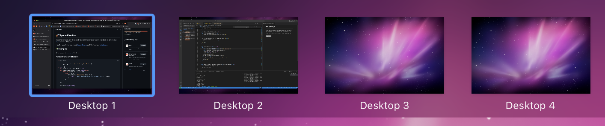

# 🚀 Space Monitor

Space Monitor is a Rust API for subscribing to real-time changes on Mac OS X to obtain the current active [space](https://support.apple.com/guide/mac-help/work-in-multiple-spaces-mh14112/mac) (virtual desktop) index.



Heavily inspired by the great work of [George Christou](https://github.com/gechr) and his Swift project - [WhichSpace](https://github.com/gechr/WhichSpace).

## 📚 Examples

Check usage in the [examples](./examples/) directory

### Async retrieval (event listener)

```rust
use std::thread;

use macos_space_monitor::{MonitorEvent, SpaceMonitor};

fn main() {
    let (monitor, rx) = SpaceMonitor::new();
    let _monitoring_thread = thread::spawn(move || {
        while let Ok(event) = rx.recv() {
            match event {
                MonitorEvent::SpaceChange(space) => {
                    println!("Space change detected! Active space is: {}", space);
                }
            }
        }
    });

    monitor.start_listening();
}
```

### Sync retrieval

```rust
use macos_space_monitor::SpaceMonitor;

fn main() {
    let space = SpaceMonitor::get_current_space_number();
    println!("Current space: {}", space);
}
```

## 🧠 How it works

Surprisingly, obtaining the active virtual desktop index is a non-trivial task on Mac OS X and attempts in doing so have been breaking release after release as the method relies on undocumented Mac OS native APIs.

This method relies on a few key ingredients:

- Core Graphics (CG)

  - We use `CGSMainConnectionID` to get a connection to the main window server
  - The CGS (core graphics services) API is exploited to obtain this information

- FFI (Foreign function interface)

  - Bridge for us to call the C APIs from Rust

- Cocoa

  - Apple's native API for Mac OS apps
  - `NSApplication` for background app
  - Handle system notifications

- Objective-C
  - Some message-passing invocations (`msg_send!`)
  - Used for receiving event notifications

Space monitor is essentially a Rust binding to access lower-level mac OS internal APIs in an easy and efficient way.

While you can occassionally deciper some esoteric plist files to derive the active screen via `defaults read com.apple.spaces SpacesDisplayConfiguration`, the contents are almost always incorrect and out of date, which makes it a non-starter for realtime change detection.

## 🐦 Swift

When I designed this crate, I wanted a minimal example I could iterate off of in Swift to simplify the migration into Rust since I'm not a Swift developer. Mostly just committing this for posterity, but you can find a much simpler implementation of this lib in Swift underneath the [./swift](./swift) directory. Once again, this is heavily inspired by [WhichSpace](https://github.com/gechr/WhichSpace), but wanted to remove all the boilerplate.

You can compile it via either of the following:

- [./swift/compile.sh](./swift/compile.sh)
- `swiftc -o SpaceMonitor CurrentSpace-types.swift CurrentSpace-main.swift CurrentSpace-delegate.swift`

Then just run:

- `./SpaceMonitor`

## ⚠️ Warning

As this crate relies on private, undocumented native Mac OS APIs internally, I _believe_ your app would be rejected from the Apple app store if this crate is used within your application. However, users can still install the application externally.
